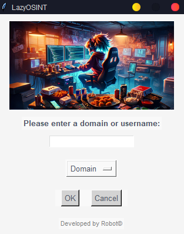

# WindowsLazyOsint

  

Domains listed here are used in the released applicaiton.

- Download release from here:
https://github.com/pentestfunctions/WindowsLazyOsint/releases

- Simply run it and you will see how it works :)

If you have suggestions on URLs we can utilize, submited a request or issue. 

## Notes

I made it request back to this github whenever it runs so that way we can update the URLs easily when things go down or we want to add more in. 

- You can still just run the code_backup.py if you want but sometimes it's nice to just have on your windows taskbar as is. 
